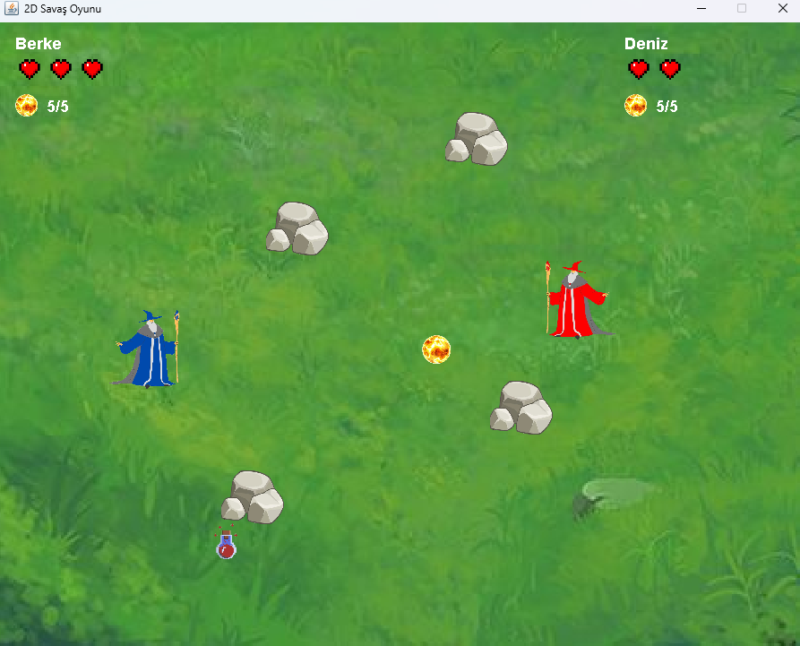

# İki Kişilik Büyücü Savaşı Oyunu 🔥🧙‍♂🧙‍♀

Bu proje, Java dili kullanılarak geliştirilen iki oyunculu bir *büyücü savaş oyunudur*. Oyuncular aynı bilgisayar üzerinde birbirlerine ateş topu fırlatarak mücadele eder.

## 🎮 Oyun Özellikleri

- *2 oyunculu rekabet*: Aynı klavye üzerinden kontrol edilir.
- *Ateş topu saldırısı*: Her oyuncu belirli aralıklarla ateş edebilir.
- *Can sistemi*: Oyuncuların 3 canı vardır, sıfıra düştüğünde oyun biter.
- *Engeller*: Oyun alanında çarpışılabilen engeller bulunur.
- *Heal (Can Toplama)*: Her 10 saniyede bir rastgele çıkan iyileştirme nesnesi sayesinde oyuncular can kazanabilir.
- *Kazanan ekranı*: Oyunun sonunda kazanan oyuncu ilan edilir ve yeniden başlatma seçeneği sunulur.

## 🎮 Kontroller

| Oyuncu | Yön Tuşları | Ateş Tuşu |
|--------|-------------|------------|
| 1. Oyuncu | W A S D | F |
| 2. Oyuncu | Yön Tuşları | L |

## 📷 Oyun İçi Görsel

## 📁 Proje Yapısı

- OyunAlani.java: Ana oyun alanı ve oyun döngüsünü kontrol eder.
- Karakter.java: Oyuncu karakterlerinin hareket ve çizim işlemleri.
- FireBall.java: Ateş toplarının hareketi ve çarpışmaları.
- Heal.java: Can artırıcı nesne.
- Harita.java ve Engel.java: Harita üzerindeki engelleri temsil eder.
- OyunSonuEkrani.java: Kazananı gösteren ekran.
- resimler/: Arka plan, karakter, kalp ve heal görselleri burada yer alır.

## 🛠 Gereksinimler

- Java 8+ JDK
- NetBeans veya başka bir Java IDE (Swing desteği olan)

## 🚀 Başlatmak için

Projeyi NetBeans ile açtıktan sonra OyunAlani sınıfının main fonksiyonundan ya da çağrıldığı sınıftan oyunu başlatabilirsin.

---

🎮 İyi oyunlar!
